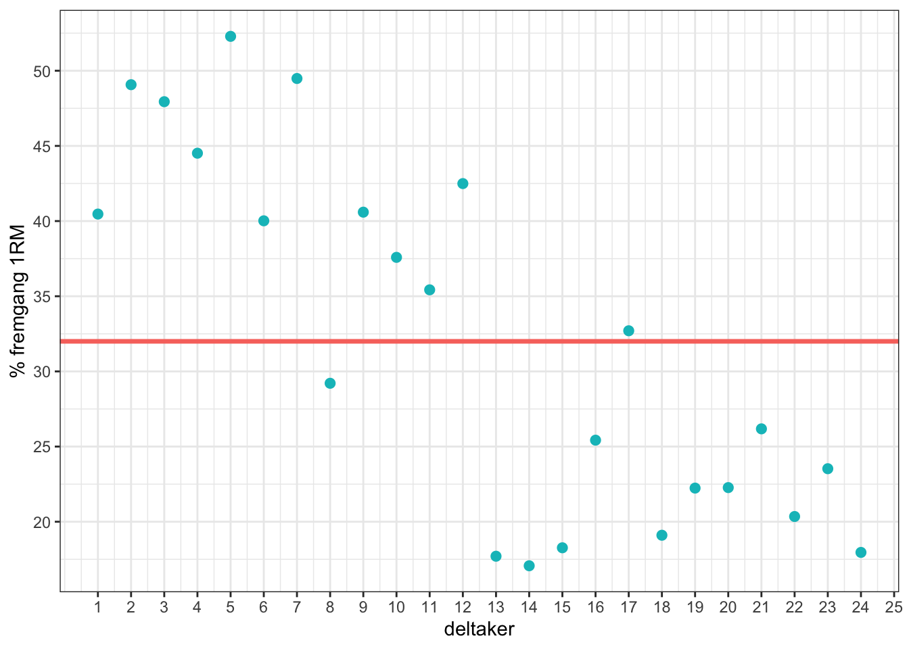

## Null-Hypothesis Significance Testing (NHST)
I forelesningene har vi snakket en god del om å teste hypoteser. Paradigmet vi bruker kalles **Null-Hypothesis Significance Testing (NHST)**, og går ut på at forskeren fremstiller to hypoteser:

1. **H0**: En null-hypotese som sier at det ikke er noen effekt (f.eks. ingen forskjeller mellom grupper, ingen sammenheng mellom variablene)
2. **H1**: En alternativ/eksperimentell hypotese som sier at det er en effekt (f.eks. det er en forskjell mellom gruppene)

Forskeren gjennomfører deretter en **statistisk test** som representerer den alternative hypotesen. Utfallet av testen er en **verdi**, for eksempel en *z-verdi*, *t-verdi* eller *f-verdi*, som vi kan bruke til å regne ut sannsynligheten for, gitt at null-hypotesen er sann. Forskjellige tester opererer med forskjellige navn på verdiene sine (sorry, men det er bare slik det er). 


## H0: Null-hypotese 
Som dere allerede vet dreier vitenskapen seg om å bygge statistiske modeller. Vi har lært at vi kan en bruke en lineær ligning til alle våre statistiske oppgaver:

$$
data = (modell) + error
$$ 

**Data** er den avhengige variabelen som vi har målt for alle deltakerne og som vi kan bruke en modell til å predikere. En **modell** er egentlig bare en representasjon av denne dataen, og tre enkle modeller som dere har lært er: **mean**, **median** og **mode**. Et fellestrekk for disse modellene er at de sier noe om den typiske skåren i datasettet. Mode sier hvilken skår som hadde flest observasjoner, medianen sier noe om den midterste verdien i datasettet når observasjonene er rangert fra høy til lav, mens gjennomsnittet...ja, den sier hva som var gjennomsnittet. I de aller fleste tilfeller er **mean** den modellen vi ønsker å benytte (en lang redegjørelse hvorfor kan jeg ikke gi her, men se tidligere forelesninger). 

I vår studie ønsker vi å teste om det er forskjeller mellom de to gruppene som har blitt disponert for ulikt treningsopplegg (3 versus 1 sett). Det første vi må spørre oss er om vi virkelig trenger å vite noe om hvordan disse deltakerne har trent eller om det er nok å bare bruke **mean** som modell. 

$$
fremgang.1RM = (mean) + error
$$ 
Det blir enklere å se hva vi mener med **mean som modell** når vi setter dette opp i en tabell, slik om i tabellen under. På denne måten ser du at modellen sier at alle deltakerne hadde samme  fremgang i 1RM (som var gjennomsnittet).


<table>
<caption>(\#tab:unnamed-chunk-3)Mean som modell</caption>
 <thead>
  <tr>
   <th style="text-align:right;"> individ </th>
   <th style="text-align:left;"> gruppe </th>
   <th style="text-align:right;"> rm </th>
   <th style="text-align:right;"> modell.mean </th>
   <th style="text-align:right;"> error </th>
  </tr>
 </thead>
<tbody>
  <tr>
   <td style="text-align:right;"> 1 </td>
   <td style="text-align:left;"> tre.sett </td>
   <td style="text-align:right;"> 40.467 </td>
   <td style="text-align:right;"> 32.162 </td>
   <td style="text-align:right;"> 8.305 </td>
  </tr>
  <tr>
   <td style="text-align:right;"> 2 </td>
   <td style="text-align:left;"> tre.sett </td>
   <td style="text-align:right;"> 49.072 </td>
   <td style="text-align:right;"> 32.162 </td>
   <td style="text-align:right;"> 16.910 </td>
  </tr>
  <tr>
   <td style="text-align:right;"> 3 </td>
   <td style="text-align:left;"> tre.sett </td>
   <td style="text-align:right;"> 47.941 </td>
   <td style="text-align:right;"> 32.162 </td>
   <td style="text-align:right;"> 15.779 </td>
  </tr>
  <tr>
   <td style="text-align:right;"> 4 </td>
   <td style="text-align:left;"> tre.sett </td>
   <td style="text-align:right;"> 44.514 </td>
   <td style="text-align:right;"> 32.162 </td>
   <td style="text-align:right;"> 12.352 </td>
  </tr>
  <tr>
   <td style="text-align:right;"> 5 </td>
   <td style="text-align:left;"> tre.sett </td>
   <td style="text-align:right;"> 52.288 </td>
   <td style="text-align:right;"> 32.162 </td>
   <td style="text-align:right;"> 20.125 </td>
  </tr>
  <tr>
   <td style="text-align:right;"> 6 </td>
   <td style="text-align:left;"> tre.sett </td>
   <td style="text-align:right;"> 40.018 </td>
   <td style="text-align:right;"> 32.162 </td>
   <td style="text-align:right;"> 7.855 </td>
  </tr>
  <tr>
   <td style="text-align:right;"> 7 </td>
   <td style="text-align:left;"> tre.sett </td>
   <td style="text-align:right;"> 49.484 </td>
   <td style="text-align:right;"> 32.162 </td>
   <td style="text-align:right;"> 17.322 </td>
  </tr>
  <tr>
   <td style="text-align:right;"> 8 </td>
   <td style="text-align:left;"> tre.sett </td>
   <td style="text-align:right;"> 29.210 </td>
   <td style="text-align:right;"> 32.162 </td>
   <td style="text-align:right;"> -2.952 </td>
  </tr>
  <tr>
   <td style="text-align:right;"> 9 </td>
   <td style="text-align:left;"> tre.sett </td>
   <td style="text-align:right;"> 40.593 </td>
   <td style="text-align:right;"> 32.162 </td>
   <td style="text-align:right;"> 8.431 </td>
  </tr>
  <tr>
   <td style="text-align:right;"> 10 </td>
   <td style="text-align:left;"> tre.sett </td>
   <td style="text-align:right;"> 37.587 </td>
   <td style="text-align:right;"> 32.162 </td>
   <td style="text-align:right;"> 5.424 </td>
  </tr>
  <tr>
   <td style="text-align:right;"> 11 </td>
   <td style="text-align:left;"> tre.sett </td>
   <td style="text-align:right;"> 35.427 </td>
   <td style="text-align:right;"> 32.162 </td>
   <td style="text-align:right;"> 3.264 </td>
  </tr>
  <tr>
   <td style="text-align:right;"> 12 </td>
   <td style="text-align:left;"> tre.sett </td>
   <td style="text-align:right;"> 42.494 </td>
   <td style="text-align:right;"> 32.162 </td>
   <td style="text-align:right;"> 10.331 </td>
  </tr>
  <tr>
   <td style="text-align:right;"> 13 </td>
   <td style="text-align:left;"> ett.sett </td>
   <td style="text-align:right;"> 17.706 </td>
   <td style="text-align:right;"> 32.162 </td>
   <td style="text-align:right;"> -14.457 </td>
  </tr>
  <tr>
   <td style="text-align:right;"> 14 </td>
   <td style="text-align:left;"> ett.sett </td>
   <td style="text-align:right;"> 17.072 </td>
   <td style="text-align:right;"> 32.162 </td>
   <td style="text-align:right;"> -15.091 </td>
  </tr>
  <tr>
   <td style="text-align:right;"> 15 </td>
   <td style="text-align:left;"> ett.sett </td>
   <td style="text-align:right;"> 18.268 </td>
   <td style="text-align:right;"> 32.162 </td>
   <td style="text-align:right;"> -13.894 </td>
  </tr>
  <tr>
   <td style="text-align:right;"> 16 </td>
   <td style="text-align:left;"> ett.sett </td>
   <td style="text-align:right;"> 25.426 </td>
   <td style="text-align:right;"> 32.162 </td>
   <td style="text-align:right;"> -6.736 </td>
  </tr>
  <tr>
   <td style="text-align:right;"> 17 </td>
   <td style="text-align:left;"> ett.sett </td>
   <td style="text-align:right;"> 32.703 </td>
   <td style="text-align:right;"> 32.162 </td>
   <td style="text-align:right;"> 0.541 </td>
  </tr>
  <tr>
   <td style="text-align:right;"> 18 </td>
   <td style="text-align:left;"> ett.sett </td>
   <td style="text-align:right;"> 19.102 </td>
   <td style="text-align:right;"> 32.162 </td>
   <td style="text-align:right;"> -13.060 </td>
  </tr>
  <tr>
   <td style="text-align:right;"> 19 </td>
   <td style="text-align:left;"> ett.sett </td>
   <td style="text-align:right;"> 22.238 </td>
   <td style="text-align:right;"> 32.162 </td>
   <td style="text-align:right;"> -9.924 </td>
  </tr>
  <tr>
   <td style="text-align:right;"> 20 </td>
   <td style="text-align:left;"> ett.sett </td>
   <td style="text-align:right;"> 22.271 </td>
   <td style="text-align:right;"> 32.162 </td>
   <td style="text-align:right;"> -9.891 </td>
  </tr>
  <tr>
   <td style="text-align:right;"> 21 </td>
   <td style="text-align:left;"> ett.sett </td>
   <td style="text-align:right;"> 26.179 </td>
   <td style="text-align:right;"> 32.162 </td>
   <td style="text-align:right;"> -5.983 </td>
  </tr>
  <tr>
   <td style="text-align:right;"> 22 </td>
   <td style="text-align:left;"> ett.sett </td>
   <td style="text-align:right;"> 20.349 </td>
   <td style="text-align:right;"> 32.162 </td>
   <td style="text-align:right;"> -11.814 </td>
  </tr>
  <tr>
   <td style="text-align:right;"> 23 </td>
   <td style="text-align:left;"> ett.sett </td>
   <td style="text-align:right;"> 23.528 </td>
   <td style="text-align:right;"> 32.162 </td>
   <td style="text-align:right;"> -8.635 </td>
  </tr>
  <tr>
   <td style="text-align:right;"> 24 </td>
   <td style="text-align:left;"> ett.sett </td>
   <td style="text-align:right;"> 17.960 </td>
   <td style="text-align:right;"> 32.162 </td>
   <td style="text-align:right;"> -14.203 </td>
  </tr>
</tbody>
</table>


La oss prøve et eksempel for å se hvordan modellen virker. For individ 1 målte vi en fremgang i 1RM underkropp på **40.467**, men modellen vår sa **32.162**. Så modellen hadde en error på **8.305**.
$$
fremgang.1RM = (mean) + error
$$
$$
40.467 = 32.162 + 8.305
$$ 
Prøv modellen du også: For individ nr. 8, sier modellen at individet hadde en skår på <input class='solveme nospaces' size='6' data-answer='["32.162"]'/>, men denne personen hadde faktisk en skår på <input class='solveme nospaces' size='6' data-answer='["29.210"]'/>. Modellen bommet derfor med <input class='solveme nospaces' size='6' data-answer='["-2.952"]'/>. 

Vi kan fortsette slik for alle deltakerne vi har hatt med i studien, men husk fra tidligere forelesninger at vi egentlig ikke er interessert i hvor mye modellen bommer <select class='solveme' data-answer='["for hvert enkelt individ"]'> <option></option> <option>for hvert enkelt individ</option> <option>totalt</option></select>, men <select class='solveme' data-answer='["totalt"]'> <option></option> <option>totalt</option> <option>for hvert enkelt individ</option></select>. Vi kan summere all erroren, men gjør vi dette får vi <select class='solveme' data-answer='["null","0"]'> <option></option> <option>null</option> <option>0</option> <option>3</option> <option>-3</option></select>. Dette er fordi <select class='solveme' data-answer='["modellen både underestimerer og overestimerer"]'> <option></option> <option>modellen både underestimerer og overestimerer</option> <option>tar feil</option></select>, så vi ender opp med både negative og positive tall. Summerer vi disse får vi <select class='solveme' data-answer='["0"]'> <option></option> <option>0</option></select>.Vi løser dette problemet effektivt ved å regne **Squared error (error^2)**. Hvis vi summerer error^2 får vi **Sum of Squared Error**. 

Vi kan regne ut hvor mye **Sum of Squared Error** vi får hvis vi bruker mean som modell. Da får vi <input class='solveme nospaces' size='8' data-answer='["3243.784"]'/>. Dette tallet er viktig! Det representerer hvor mye error det i en modell der vi bruker mean som modell. Dette er null-hypotesen vår. Hvis det ikke er noen forskjell mellom gruppene er det like gret å bare å bare bruke mean som modell. Men hvis vi finner ut at modellen vår blir bedre (dvs. reduserer Sum of Squared Error) ved å legge til en prediktorvariabel som består er av gruppevariabelen vår, da bør vi gjøre dette. Hvordan vi gjør dette blir temaet i neste avsnitt. 

Før du går videre er det greit å visualisere hvordan null-hypotesen ser ut rent visuelt. Den rød streken i figuren under representerer modellen vår som er mean. Som du ser, så gjør den ingen justeringer for de ulike individene. 


```r
ggplot(dat, aes(individ, rm)) + 
  geom_point(size=2.2, color="#00BFC4") +
  geom_hline(yintercept = 32, color="#f8766D", size=1.2) +
  scale_x_continuous(breaks = seq(1, 25)) +
  scale_y_continuous(breaks = seq(0, 60, 5)) + 
  labs(x="deltaker", y="% fremgang 1RM") +
  theme_bw()
```

<div class="figure" style="text-align: center">

<p class="caption">(\#fig:unnamed-chunk-4)**CAPTION THIS FIGURE!!**</p>
</div>


## H1: Alternativ hypotese
I forrige avsnitt sa vi at **null-hypotesen (H0)** er en modell som gir samme prediksjon for alle deltakerne som var med i studien uavhengig av hvilken treningsgruppe de tilhører. Vi regnet også at denne modellen ga oss en Som of Squared error på 3243.784. Spørsmålet vi skal stille nå er om vi kan redusere denne erroren ved å benytte en me kompleks modell som har med gruppe som prediktorvariabel:
$$
Y_i = b0 + b1 + error_i
$$ 
Prediktorvariabelen b1 er gruppevariabelen vår som vi dummykodet med 0 og 1. 

$$
Fremgang.1RM_i = b0 + b1(Gruppe) + error_i
$$ 
Før vi går videre tror jeg det er best at vi gir dere verdiene i denne modellen for å vise hvordan den fungerer.

$$
Fremgang.1RM_i = 21.90 + b1(20.52*Gruppe) + error_i
$$ 
Modellen sier at vi har en intercept på 21.90. Dette er verdien når predictorvariabelen er 0. Den sier også at vi vi har en slope på 20.52. Med andre ord hvor vi må øke vår prediksjon med for en enhets øktning i X. Vi brukte 0 og 1 for å kode våre to grupper. Så hvis et individ tilhørte gruppe 0, blir vår prediksjon:

$$
Fremgang.1RM_i = 21.90 + b1(20.52*0) + error_i
$$ 
$$
Fremgang.1RM_i = 21.90 + 0 + error_i
$$ 
$$
Fremgang.1RM_i = 21.90 + error_i
$$ 
Hvis individet tilhører 0 gruppen er vår prediksjon 21.90. 

$$
Fremgang.1RM_i = 21.90 + b1(20.52*1) + error_i
$$ 
$$
Fremgang.1RM_i = 42.48 + error_i
$$ 
Hvis individet tilhører 1 gruppen er vår prediksjon 42.48.


I R og Jamovi kan du gjøre det med følgende if/else statement. I R kan du bruke følgende kode:


```
## 
## Call:
## lm(formula = rm ~ dummykodet, data = dummykodet.dat)
## 
## Coefficients:
## (Intercept)   dummykodet  
##       21.90        20.52
```


Så det vi skal finne ut av er om mod

$$
Yi = b0 + error
$$ 

Det vi skal gjøre nå er å spørre oss nå er om det er behov for å legge til en ekstra prediktorvariabel i modellen eller om det er nok å beholde den ene prediktorvariabelen? Så det vi skal spørre oss om nå er

$$
 = mean + error
$$ 
En annen måte å si dette på er om det er forskjeller mellom de to gruppene eller om det ikke er det. Hvis det ikke er noen forskjeller mellom gruppene, så vil b1 være liten, og vil egentlig bare ende opp med samme prediksjon uansett hvilken gruppe de har tilhørt. Jeg har nå regnet ut hva verdiene i modellen er, så vi få et inntrykk av hvordan modellen virker før vi finner ut hvordan vi regner disse verdiene. Når jeg har brukt dummykoding har jeg fått følgende verdier i min modell:

$$
%1RM = b0 + b1 + error
$$

$$
%1RM = 21.90  + b1(20.52*gruppe) + error
$$

Husk at gruppen vår er dummykodet som 0 og 1. Så hvis jeg har å gjøre med et individ som tilhører gruppe 0, så blir resultatet følgende

$$
%1RM = 21.90  + b1(20.52*0) + error
$$

$$
%1RM = 21.90 + error
$$
20.52*0 = 0, så vår prediksjon av et individ som tihører gruppe 0 blir da kun 21.90. Hvis vi har en person tilhørte gruppe 1, så blir vår prediksjon 

$$
%1RM = 21.90 + b1(20.52*1) error
$$
Som blir 42.42. Hva er spesielt med disse verdiene? Gå tilbake til. 


```r
library(tidyverse)
```


```r
set.seed(2002) #viktig å ha med denne for å få nøyaktig samme datasett
tre.sett <- rnorm(n = 12, mean = 41, sd = 5) #12 individer
ett.sett <-rnorm(n = 12, mean = 21, sd = 5) #12 individer

#lager en tibble fra tidyverse-pakken. Må ha lastet inn tidyverse library(tidyverse) i scriptfilen
dat <- tibble(individ = seq(1:24),
              gruppe = rep(c("tre.sett ", "ett.sett"), c(length(tre.sett), length(ett.sett))),
              rm = c(tre.sett , ett.sett))


#lager et nytt objekt som heter dummykodet.dat
dat <- dat %>%
  # her lager jeg en ny kolonne som heter dummykoder. If gruppe == 'ett.sett', gi verdien 0, else gi de 1.
  mutate(dummykodet = if_else(gruppe == "ett.sett", 0, 1)
  )


dat <- dat %>%
  # her lager jeg en ny kolonne som heter dummykoder. If gruppe == 'ett.sett', gi verdien 0, else gi de 1.
  mutate(kontrast = if_else(gruppe == "ett.sett", -0.5, 0.5)
  )

dat <- dat %>%
  mutate(dummykodet = as.factor(dummykodet),
         kontrast = as.factor(kontrast))
```


```r
lm(rm ~ dummykodet, dat)
```

```
## 
## Call:
## lm(formula = rm ~ dummykodet, data = dat)
## 
## Coefficients:
## (Intercept)  dummykodet1  
##       21.90        20.52
```

```r
library(tidyverse)


ggplot(dat, aes(y=rm, x=individ)) + 
  geom_point(aes(colour=gruppe)) +
  geom_smooth(method="lm", formula=y~x) +
  
  scale_x_discrete()
```

<div class="figure" style="text-align: center">

<p class="caption">(\#fig:unnamed-chunk-10)**CAPTION THIS FIGURE!!**</p>
</div>

Her fikk jeg en intercept på 21.90 og en slope på 20.52. La oss prøve å få disse to til. 

$$
Y = b0 + b1 + error
$$
$$
Y = b0 + (b1*0) + error
$$

$$
$$
Y = b0 + (b1*1) + error
$$


